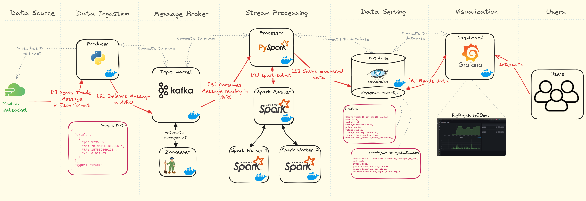
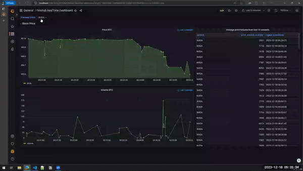

# Finnhub Realtime Pipeline

The project involves building a data pipeline that streams real-time trading data from the [Finnhub.io](https://finnhub.io/) using websockets. This data is then processed using Spark for analysis and realtime dashboard.

## Architecture

<!--  -->


All applications are containerized into Docker containers

1. **Data source layer** - Finnhub.io offering real-time trades for US stocks, forex and crypto using websockets

2. **Data ingestion layer** - A containerized Python application named producer connects to the Finnhub.io websocket. It encodes retrieved messages into Avro format, as specified in the `schemas/trades.avsc` file, and ingests messages into the Kafka broker.

3. **Message broker layer** - Messages from producer are consumed by the Kafka broker located in the broker container.

4. **Stream processing layer** - A Spark cluster consisting of one master and two worker node is set up. A PySpark application named processor is submitted to the Spark cluster manager, which delegates a worker for it. This application connects to the Kafka broker to retrieve messages, transforms them using Spark Structured Streaming, and loads them into Cassandra tables. The first query, which transforms trades into a feasible format, runs continuously, whereas the second query, involving aggregations, has a 5-second trigger.

5. **Data serving layer** - A Cassandra database stores and persists data from Spark jobs. Upon launching, the `cassandra-setup.cql` script runs to create the keyspace and tables.

6. **Visualization layer** - Grafana connects to the Cassandra database using HadesArchitect-Cassandra-Plugin and serves visualized data to users, exemplified in the Finnhub Sample BTC Dashboard. The dashboard refreshes every 500ms.


## Dashboard

A live dashboard that constantly updates to display trade prices every 500 milliseconds.



## Setup & deployment

1. **Obtain an API Key:** Register at [Finnhub](https://finnhub.io/) to generate your API key

2. **Configure Environment Variables:**
   - Locate and rename the `[sample.env](sample.env)` file to `.env`
   - Update the `.env` file with the generated API key and any necessary configurations
    ```text
    FINNHUB_API_TOKEN=abc123xyz
    FINNHUB_STOCKS_TICKERS=["AAPL", "AMZN", "MSFT", "GOOG", "NVDA", "META", "TSLA", "NFLX",  "BINANCE:BTCUSDT", "IC MARKETS:1"]
    FINNHUB_VALIDATE_TICKERS=1
    KAFKA_SERVER=broker
    KAFKA_PORT=29092
    KAFKA_TOPIC_NAME=market
    CASSANDRA_HOST=cassandra
    CASSANDRA_PORT=9042
    CASSANDRA_USERNAME=cassandra
    CASSANDRA_PASSWORD=cassandra
    ```
3. **Start the Service:** Launch the services
    ```
    make run
    ```
4. **View Producer Logs:** Check the logs of the producer container to monitor activity

5. **Execute Spark Job:** Submit the Spark job 
    ```
    make spark-job
    ```
6. **Access Visualization:** Open your browser and go to `localhost:3003` to view the visualization. Enter admin for username and password.

7. **Shutdown Containers:** Stop all running containers
    ```
    make down
    ```
